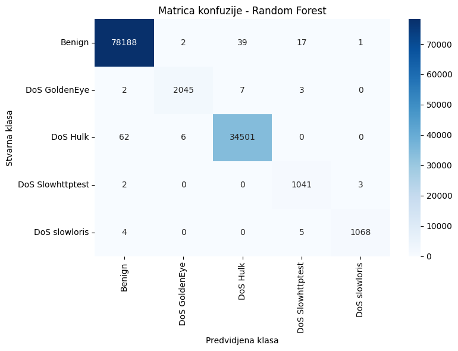
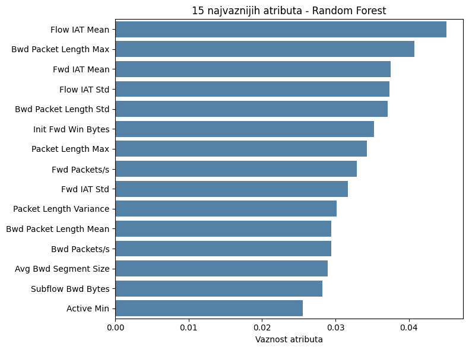
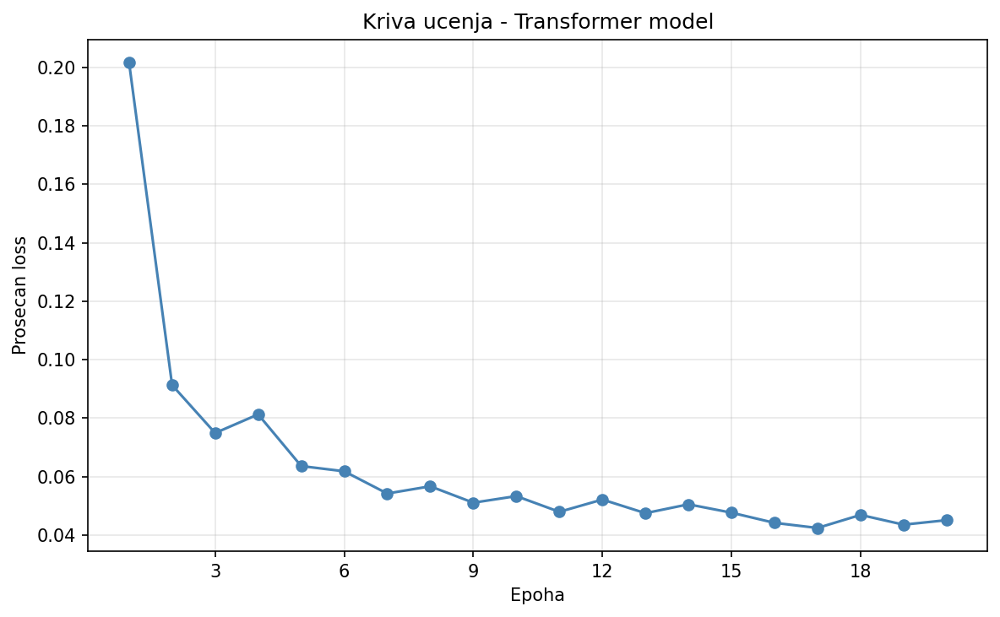
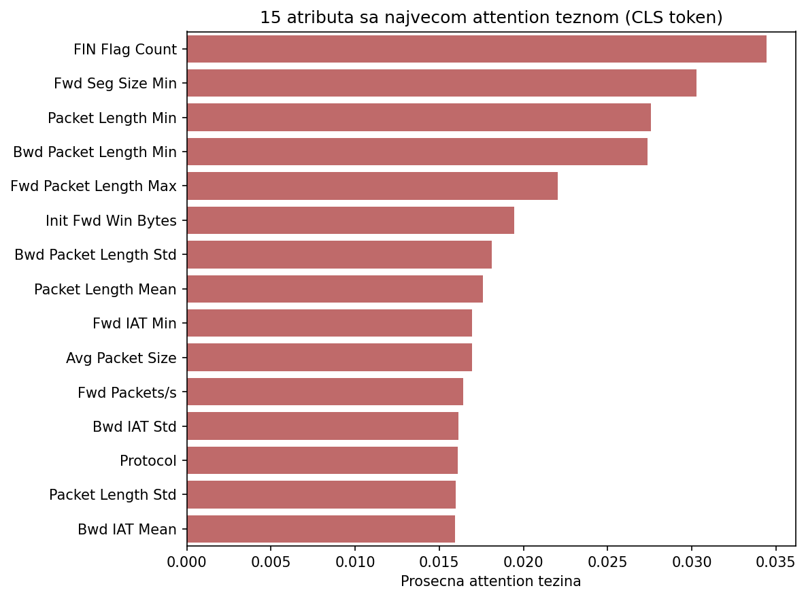
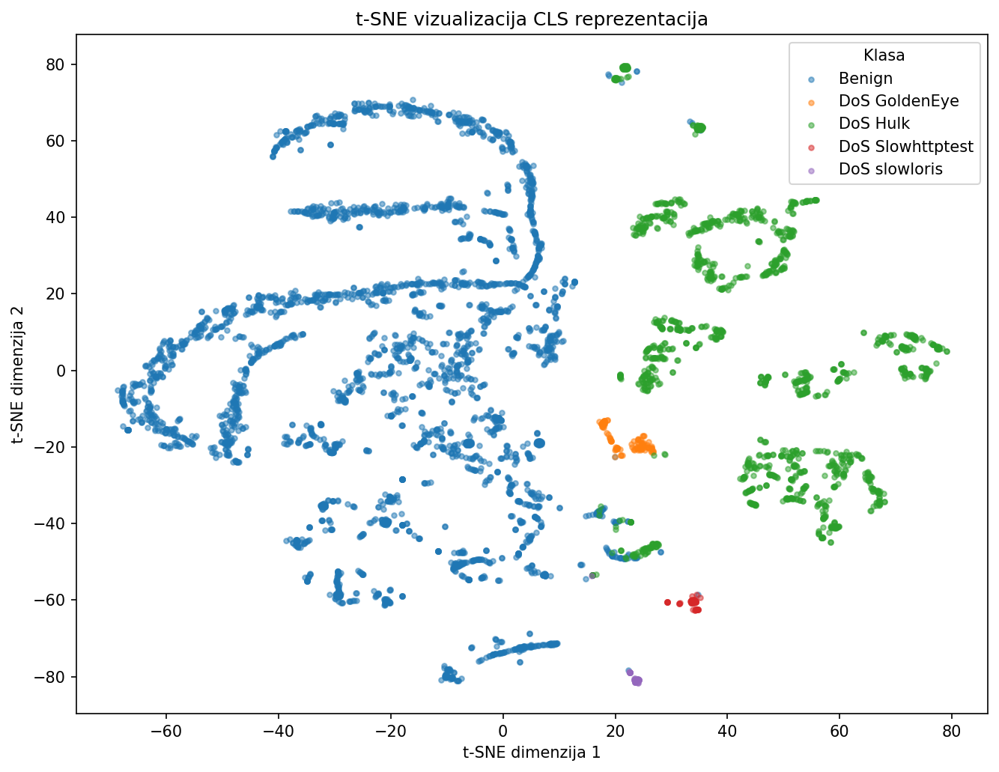

# DoS Attack Detection Using Transformer Architecture

This project explores the application of a Transformer-based neural network for multiclass detection of Denial-of-Service (DoS) attacks using the CICIDS2017 dataset.

The project was developed as part of my Bachelor's thesis at the University of Belgrade, Faculty of Organizational Sciences, Software Engineering module. The proposed Transformer model is evaluated against a Random Forest baseline, with additional analysis of learned representations, attention weights, model stability, and statistical comparison using the McNemar test.

> **Note:** The notebooks contain explanatory text and code comments in Serbian, as the project was originally developed as part of a Bachelor's thesis. The README is provided in English to make the project overview accessible to a broader audience.

## Key Results

- **Random Forest baseline:** 99.87% test accuracy
- **Transformer model:** 98.52% test accuracy
- **Transformer stability:** 98.53% ± 0.04 percentage points across three training runs with different random seeds
- **McNemar test:** statistically significant difference between model predictions (p < 0.001)

## Dataset

The project uses the Wednesday traffic data from the CICIDS2017 dataset, which contains benign network traffic and several types of DoS attacks. After excluding the Heartbleed class, the dataset contains 584,980 instances.

The classification task includes five classes:

- Benign
- DoS GoldenEye
- DoS Hulk
- DoS Slowhttptest
- DoS slowloris

After preprocessing, 67 numerical network traffic features are used as input to the models. The data is split into 80% training and 20% test sets using stratified sampling to preserve the original class distribution.

## Methodology

The project follows a complete machine learning pipeline:

1. **Data exploration** – inspection of the CICIDS2017 Wednesday traffic data, class distribution, missing values, and feature characteristics.
2. **Preprocessing** – removal of invalid and duplicate instances, label encoding, stratified train/test split, removal of zero-variance features based on the training set, and feature standardization using `StandardScaler`.
3. **Random Forest baseline** – training and evaluation of a Random Forest classifier with class weighting to address class imbalance.
4. **Transformer model** – implementation of a custom Transformer-based classifier in PyTorch, where each numerical feature is represented as a learnable token embedding and a CLS token is used for final classification.
5. **Model analysis** – evaluation using classification metrics and confusion matrices, together with attention-weight analysis, t-SNE visualization of learned CLS representations, and stability analysis across multiple random seeds.
6. **Statistical comparison** – paired comparison of Random Forest and Transformer predictions using the McNemar test.

## Transformer Architecture

The Transformer classifier is adapted to process tabular network traffic data. Each of the 67 numerical input features is transformed into a 32-dimensional learnable representation. A learnable CLS token is prepended to the feature sequence and its final representation is used for classification.

The main architecture consists of:

- **Input features:** 67
- **Embedding dimension (`d_model`):** 32
- **Transformer encoder layers:** 2
- **Attention heads:** 4
- **Dimension per attention head:** 8
- **Feed-forward dimension:** 128
- **Dropout:** 0.1
- **Output classes:** 5

The encoded CLS representation is passed through a feed-forward classification head to produce logits for the five traffic classes.

## Project Structure

```text
dos-attack-detection-transformer/
│
├── notebooks/
│   ├── 01_data_exploration.ipynb
│   ├── 02_preprocessing.ipynb
│   ├── 03_random_forest_baseline.ipynb
│   ├── 04_transformer_model.ipynb
│   └── 05_model_comparison.ipynb
│
├── data/
│   └── .gitkeep
│
├── results/
│
├── requirements.txt
├── .gitignore
└── README.md
```

The notebooks are intended to be executed in numerical order:

1. `01_data_exploration.ipynb` – downloads and explores the CICIDS2017 Wednesday dataset.
2. `02_preprocessing.ipynb` – cleans, splits, and scales the data and prepares the files required for model training.
3. `03_random_forest_baseline.ipynb` – trains and evaluates the Random Forest baseline.
4. `04_transformer_model.ipynb` – trains and evaluates the Transformer model and performs additional representation and attention analyses.
5. `05_model_comparison.ipynb` – performs the final statistical comparison of the two models using the McNemar test.

Generated datasets and intermediate files are stored locally in the `data/` directory and are excluded from version control. Selected visualizations produced by the models are stored in the `results/` directory.

## How to Run

### 1. Clone the repository

```bash
git clone <repository-url>
cd dos-attack-detection-transformer
```

### 2. Install dependencies

```bash
pip install -r requirements.txt
```

### 3. Configure Kaggle authentication

The dataset is downloaded from Kaggle using `kagglehub`.

When running the notebooks in Google Colab, Kaggle credentials can be stored as Colab Secrets using the names `KAGGLE_USERNAME` and `KAGGLE_KEY`.

For local execution, Kaggle credentials should be configured in the local environment before running the first notebook. Credentials should never be stored directly in the source code or committed to the repository.

### 4. Run the notebooks

Run the notebooks in numerical order:

```text
01_data_exploration.ipynb
        ↓
02_preprocessing.ipynb
        ↓
03_random_forest_baseline.ipynb
        ↓
04_transformer_model.ipynb
        ↓
05_model_comparison.ipynb
```

The notebooks should be executed with the repository root as the current working directory. This ensures that generated files are correctly stored in the `data/` and `results/` directories.

For local execution, start Jupyter from the repository root:

```bash
jupyter notebook
```

The generated data and intermediate model results will be stored in `data/`, while generated visualizations will be stored in `results/`.

## Tech Stack

- **Python** – implementation of the complete machine learning pipeline
- **pandas & NumPy** – data manipulation and numerical processing
- **scikit-learn** – preprocessing, Random Forest baseline, evaluation metrics, and t-SNE
- **PyTorch** – implementation and training of the Transformer classifier
- **Matplotlib & Seaborn** – data and model visualizations
- **statsmodels** – McNemar statistical test
- **KaggleHub** – programmatic dataset download
- **Jupyter / Google Colab** – development and experimentation environment

## Results & Visualizations

### Model Performance

The Random Forest baseline achieved **99.87% test accuracy**, while the Transformer model achieved **98.52%**. The confusion matrices below provide a class-level view of their predictions.

#### Random Forest



#### Transformer


### Random Forest Feature Importance

The most influential features identified by the Random Forest model are shown below. Feature importance is based on the model's mean decrease in impurity (MDI).



### Transformer Training

The training loss decreased consistently over the 20 training epochs.



### Attention Analysis

Attention weights from the first Transformer encoder layer were analyzed for the `[CLS]` token. The visualization shows the average attention assigned to individual network traffic features across attention heads for one batch of test samples.



### Learned Representations

The learned `[CLS]` representations were projected into two dimensions using t-SNE. A fixed random sample of **5,000 test instances** was used to make the visualization reproducible across runs.



### Statistical Comparison

A McNemar test was used to compare the predictions of the two models on the same test set. The difference was statistically significant (**p < 0.001**), with the Random Forest producing more correct predictions overall.